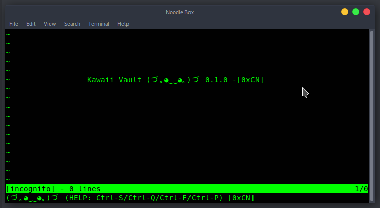

#Kawaii Vault (づ｡◕‿‿◕｡)づ

##setup
You need to fill in Config.toml with the required info.
```toml
id = (gist-id)
access_token = GitHub Token (that has access to gist)

[files]
vaultd = (gist-vaultd-filename)
unique = (gist-unique-filename)
```
Here is an [example gist](https://gist.github.com/0xCN/bd758a3bfacfba6917a5c5badcfe9004).


##initialization
```bash
./kawaii-vault initialize
```
The **password** you choose in this step will be used in decryption.


##usage
on editor mode
```
CTRL-S: Save
CTRL-Q: Quit
CTRL-F: Find
CTRL-P: Generate a Password
```
